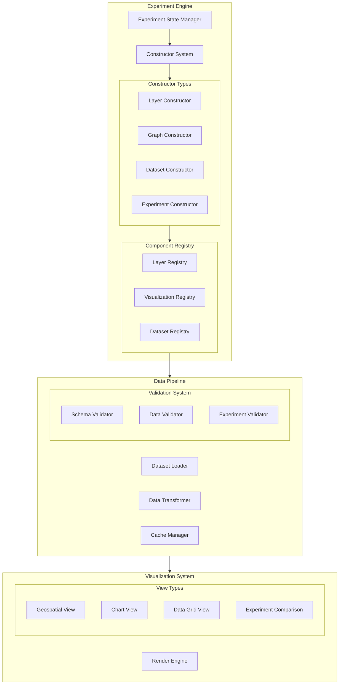

# visbuilder
Ability to examine and construct experiments given some arbitrary datasets

I'll help you design a modular architecture for a geospatial dashboard that can scale well and allow for easy feature additions. Let me break this down systematically.

```mermaid
flowchart TB
    subgraph Frontend["Frontend (React)"]
        UI["UI Components"]
        subgraph CoreComponents["Core Components"]
            Map["MapContainer<br/>(DeckGL)"]
            DataGrid["DataGrid<br/>(Table Views)"]
            Charts["ChartContainer"]
        end
        subgraph StateManagement["State Management"]
            Store["Redux Store"]
            Query["Query Builder"]
        end
        subgraph Services["Frontend Services"]
            DataTransformers["Data Transformers"]
            CacheService["Cache Service"]
            GeoUtils["Geo Utilities"]
        end
    end

    subgraph Backend["Backend Services"]
        API["API Gateway"]
        subgraph QueryEngine["Query Engine"]
            Athena["Athena Service"]
            QueryBuilder["SQL Generator"]
            QueryCache["Query Cache<br/>(Redis)"]
        end
        subgraph DataServices["Data Services"]
            GeoProcessor["Geo Processing<br/>Service"]
            DataValidator["Data Validator"]
            ETLMonitor["ETL Monitor"]
        end
    end

    subgraph Storage["Data Storage"]
        S3["S3 Data Lake"]
        MetaStore["Metadata Store"]
        ConfigStore["Config Store"]
    end

    UI --> CoreComponents
    CoreComponents --> StateManagement
    StateManagement --> Services
    Services --> API
    API --> QueryEngine
    QueryEngine --> DataServices
    DataServices --> Storage

```




Let me break down the proposed architecture and implementation approach:

1. Frontend Architecture:
```typescript
// Core component structure
interface MapComponentProps {
  layers: Layer[];
  viewState: ViewState;
  onViewStateChange: (viewState: ViewState) => void;
  interactionHandlers?: InteractionHandlers;
}

// Data management hook
const useGeospatialQuery = (queryConfig: QueryConfig) => {
  const { data, isLoading, error } = useQuery({
    queryKey: ['geo-data', queryConfig],
    queryFn: () => fetchGeoData(queryConfig),
    staleTime: 5 * 60 * 1000 // 5 minutes
  });
  
  return { data, isLoading, error };
};
```

2. Backend Services:
```python
# Query builder service
class QueryBuilder:
    def build_geospatial_query(self, params: dict) -> str:
        """Builds an Athena query based on parameters"""
        base_query = """
        SELECT 
            geometry,
            properties,
            metrics
        FROM {table}
        WHERE ST_CONTAINS(
            ST_GEOMFROMTEXT('{bbox}'),
            geometry
        )
        """
        return self.apply_filters(base_query, params)
```

3. Implementation Strategy:

A. Start with core infrastructure:
- Set up AWS infrastructure using CDK/Terraform
- Implement basic React app with DeckGL integration 
- Create data fetching layer with query builder

B. Build modular components:
- Map container with layer management
- Data grid for tabular views
- Chart components using Recharts
- Query builder interface

C. Add features incrementally:
- Layer management system
- Caching strategy
- ETL monitoring
- Validation systems

Key Technical Decisions:

1. Data Flow:
- Use React Query for data fetching/caching
- Implement WebSocket for real-time updates
- Redis cache for frequent queries

2. Performance Optimization:
- Implement tile-based loading for large datasets
- Use WebWorkers for heavy computations
- Implement virtual scrolling for large data grids

3. Extensibility:
- Plugin system for new visualizations
- Configuration-driven layouts
- Middleware pattern for data transformations


Let me break down the architectural design focusing on constructors and modular systems for experiment visualization and analysis.


Key Architectural Components:

1. Constructor System
   - Factory pattern for creating visualization components
   - Plugin architecture for adding new constructors
   - Configuration-driven component generation
   - Dependency injection for services and utilities

2. Registry System
   - Central repository of available components
   - Dynamic registration of new visualizations
   - Component metadata management
   - Version control for experiments

3. Dataset Management
   - Abstract dataset interface
   - Pluggable data source adapters
   - Transformation pipeline
   - Caching strategy

4. Experiment Engine
   - Experiment state management
   - Configuration persistence
   - Version control
   - Comparison utilities

Core Abstraction Layers:

1. Layer Constructor Framework
   - Base layer interface
   - Layer composition system
   - Style management
   - Interactive feature management

2. Graph Constructor Framework
   - Visualization type registry
   - Data binding system
   - Interactive control system
   - Layout management

3. Dataset Constructor Framework
   - Data source abstraction
   - Schema management
   - Transformation pipeline
   - Validation system

Extension Points:

1. Plugin System
   - New visualization types
   - Custom data transformers
   - Additional validators
   - Custom interaction handlers

2. Configuration System
   - JSON-based configuration
   - Template system
   - Inheritance and override capabilities
   - Version control

3. Event System
   - Inter-component communication
   - State change notifications
   - Error handling
   - User interaction events

Development Priorities:

1. Foundation Layer
   - Core constructor system
   - Basic registry
   - Simple data pipeline
   - Essential validators

2. Component Layer
   - Basic visualizations
   - Data grid
   - Map integration
   - Chart system

3. Extension Layer
   - Plugin system
   - Advanced constructors
   - Custom validators
   - Additional visualizations

4. Integration Layer
   - Experiment management
   - Version control
   - Comparison tools
   - Export capabilities

This architecture emphasizes:
- Modularity through constructor patterns
- Extensibility via registries
- Flexibility in data handling
- Clear separation of concerns
- Plugin-based enhancement

Would you like me to elaborate on any of these components or discuss specific patterns for implementation?