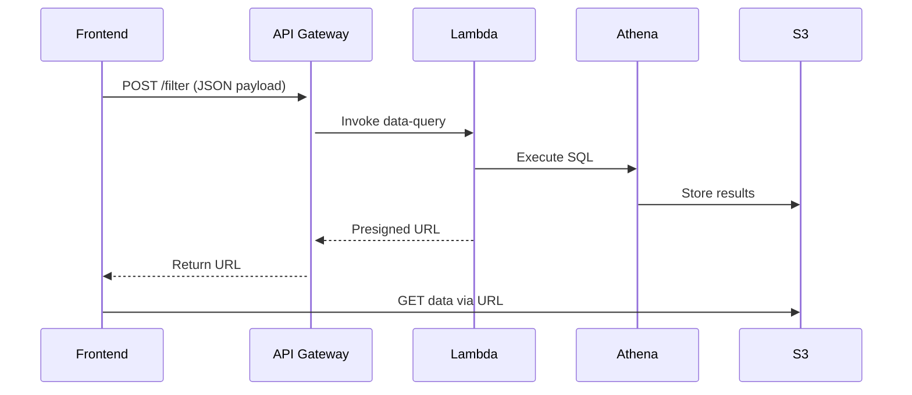

Here's a structured AI Code Builder outline with critical considerations for your VisBuilder deployment:

---

### **AI Code Builder Outline: VisBuilder AWS Implementation**

#### **1. Discovery & Setup**  
**AI Tasks:**  
- Parse project README and existing code structure  
- Analyze AWS dependencies (S3/Athena access patterns)  
- Identify required Lambda permissions (Athena, S3)  

**Code Generation Focus:**  
```python
# AWS Service Templates
aws_services = {
  "frontend": {"type": "s3+cloudfront", "cors_rules": [...]},
  "backend": {
    "lambda_functions": ["data-query", "filter"],
    "api_gateway": {
      "routes": ["GET /data", "POST /filter"],
      "cors": {"origin": "https://your-cloudfront-domain"}
    }
  }
}
```

**Watch For:**  
- Athena workgroup configuration mismatches  
- S3 bucket region alignment with Athena  
- Cold start implications for Lambda  

---

#### **2. Backend Implementation**  

**A. Lambda + Athena Integration**  
**AI-Generated Template:**  
```python
# data-query/lambda_function.py
import boto3

def handler(event, context):
    # Event format: {"region": "CONUS", "filters": {...}}
    athena = boto3.client('athena')
    
    # Generated query with WHERE clauses based on event["filters"]
    query = f"""
        SELECT * FROM geospatial_data
        WHERE region='{event["region"]}'
        {apply_filters(event["filters"])}
        LIMIT 10000
    """
    
    result = athena.start_query_execution(
        QueryString=query,
        ResultConfiguration={'OutputLocation': 's3://query-results/'})
    
    return {"queryId": result['QueryExecutionId']}
```

**Key Considerations:**  
- Implement query validation to prevent SQL injection  
- Use Athena's `EXPLAIN` to estimate data scanned  
- Generate pre-signed URLs for filtered S3 data:  
```python
# Generate presigned URL (30-minute expiry)
presigned_url = s3_client.generate_presigned_url(
    'get_object',
    Params={'Bucket': 'results', 'Key': query_id + '.csv'},
    ExpiresIn=1800
)
```

---

**B. API Gateway Configuration**  
**AI Logic Flow:**  


**Critical Checks:**  
- Match API timeout (29s max) to Lambda timeout  
- Enable CORS for CloudFront domains  
- Configure binary media types for geospatial formats  

---

#### **3. Security Implementation**  
**AI Automation Targets:**  
1. IAM Policy Generation (Least Privilege):  
```python
# AI-analyzed permissions
policy = {
    "Version": "2012-10-17",
    "Statement": [
        {
            "Effect": "Allow",
            "Action": [
                "athena:StartQueryExecution",
                "s3:GetObject"
            ],
            "Resource": [
                "arn:aws:athena:*:123456789012:workgroup/primary",
                "arn:aws:s3:::query-results/*"
            ]
        }
    ]
}
```

2. Cognito Integration Example (Generated Flow):  
```typescript
// Frontend Auth Hook (React)
const { login } = useCognito({
  userPoolId: AI_ENV.USER_POOL_ID,
  clientId: AI_ENV.CLIENT_ID,
  region: AI_ENV.REGION
});

// Protect API calls
axios.interceptors.request.use(async (config) => {
  config.headers.Authorization = await getSessionToken();
  return config;
});
```

**Security Gotchas:**  
- Never hardcode API keys in Lambda environment variables  
- Mandate TLS 1.2+ for all API endpoints  
- Validate S3 bucket ownership before presigned URL access  

---

#### **4. Performance Optimization**  

**AI-Generated Cache System**  
```python
# ElastiCache Redis pattern
def cached_athena_query(query, params):
    key = hashlib.sha256(f"{query}_{params}".encode()).hexdigest()
    if (result := redis.get(key)):
        return json.loads(result)
    
    # Cold path
    raw = run_athena_query(query, params)
    redis.setex(key, 3600, json.dumps(raw))  # 1hr TTL
    return raw
```

**Performance Watchlist:**  
- Athena parallel query limits (consider concurrent runs)  
- Lambda memory allocation vs pricing tradeoff (use 1769MB for vCPU)  
- Mapbox GL JS lazy loading thresholds for large geojson  

---

#### **5. Frontend Integration**  

**AI-Generated API Client**  
```typescript
// frontend/src/api/client.ts
export const fetchGeospatialData = async (filters: FilterParams) => {
  const response = await axios.post<{ url: string }>(
    API_ENDPOINT + '/data', 
    { region: 'CONUS', ...filters }
  );
  
  // Directly get results from presigned URL
  return axios.get<GeoJSON.FeatureCollection>(response.data.url);
};

// Usage with useQuery
const { data } = useQuery(['geo', filters], () => fetchGeospatialData(filters));
```

**Visualization Pitfalls:**  
- DeckGL auto-resolution scaling for mobile  
- Plotly.js webgl vs svg rendering thresholds  
- GeoJSON simplification at zoom-levels  
```typescript
// Adaptive simplification example
const simplifiedData = useMemo(() => 
  simplify(geojson, { tolerance: zoomLevel * 0.001 }),
[geojson, zoomLevel]);
```

---

### **Implementation Checklist**  
1. **Testing Pyramid**  
   - Unit: Lambda query builders (validate SQL outputs)  
   - Integration: API Gateway + Lambda + S3 presigned URLs  
   - E2E: Frontend filter -> Map rendering workflow  

2. **Error Scenarios**  
   ```python
   # Lambda error templates
   class AthenaTimeout(Exception): ...
   class FilterValidationError(Exception): ...
   
   def handler(event, context):
       try:
           # Logic
       except AthenaTimeout:
           return {"error": "Query too large - refine filters"}
   ```

3. **Cost Controls**  
   - Athena cost threshold alarms in CloudWatch  
   - Lambda concurrency limits (prevent runaway scaling)  
   - S3 lifecycle policies for query result cleanup  

---

### **Critical Anti-Patterns to Avoid**  
1. **Large Payload Lambda Returns**  
   ❌ Returning 10MB+ datasets directly through API Gateway  
   ✅ Always use presigned URLs for S3 object access  

2. **Athena On-the-Fly Filtering**  
   ❌ `SELECT * FROM huge_table WHERE ST_Contains(...)` on raw GeoJSON  
   ✅ Pre-process spatial partitions using QGIS/GeoPandas into S3 folders  

3. **Frontend Data Choking**  
   ❌ Loading 10M rows directly into browser memory  
   ✅ Implement server-side pagination + viewport-based filtering  

---

### **AI-Assisted Development Workflow**  
1. Start with the API Gateway (OpenAPI spec generation)  
2. Generate Lambda boilerplate with boto3 patterns  
3. Auto-create CloudFormation templates from code  
4. Generate unit tests with mocked AWS API responses  
5. Optimize Athena queries using query plan analysis  

Use this outline as a living document - update thresholds (e.g., Lambda timeouts) as you observe real-world workload patterns.